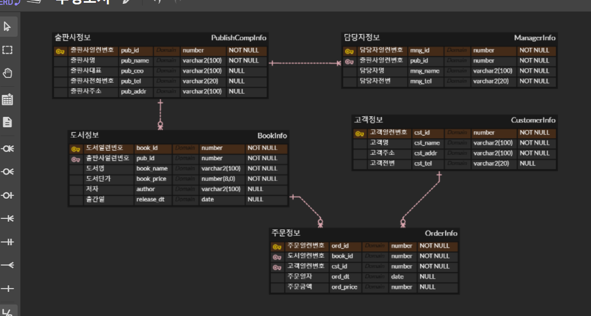

## 토이프로젝트
Python GUI - Oracle 연동 프로그램

### GUI 프레임워크
    1. tkinter - 파이썬에 내장된 GUI 라이브러리
    2. PyQt / PySide 
        - C/C++에서 사용하는 GUI 프레임워크 Qt를 파이썬에 사용하게 만든 라이브러리. 현재 6버전 출시, 유료
        - PyQt의 사용라이센스 문제로 PySide 릴리즈. PyQt에서 PySide로 변겅하는데 번거로움 존재
        - tkinter 보다 난이도가 있음
        - 아주 이쁨. QtDesigner툴로 포토샵처럼 GUI 디자인 가능
        - Python GUI중에서 가장 많이 사용중
    3. Kivy
        - OpenGL(게임엔진용 3D 그래픽엔진)으로 구현되는 GUI 프레임워크
        - 안드로이드, iOS 등 모바일용으로도 개발 가능
        - 최신에 나온 기술이라 아직 불안정
    4. wxPyton
        - Kivy처럼 멀티플랫폼 GUI 프레임워크
        - 매우 어려움

### PyQt5 GUI 사용
- PyQt5 설치
    - 콘솔 pip install PyQt5

- QtDesigner 설치
    - https://build-system.fman.io/qt-designer-download 다운로드 후 설치

#### PyQt5 개발
1. PyQt 모듈 사용 윈앱 만들기
2. 윈도우 기본 설정
3. PyQt 위젯 사용법(레이블, 버튼)
4. 시그널(이벤트) 처리방법
5. QtDesigner로 화면 디자인, PyQt와 연동


#### Oracle 연동 GUI 개발 시작
- 오라클 Python 연동 DB(스키마) 생성
- Student 테이블 생성
    ```sql
    -- sys(sysdba)로 작업

    -- madang 스키마, 사용자 생성
    CREATE USER madang IDENTIFIED BY madang;

    -- 권한 설정
    GRANT CONNECT, resource TO madang;

    -- madang으로 사용 스키마 변경

    -- 테이블 Student 생성
    CREATE TABLE students(
        std_id 		NUMBER 			PRIMARY KEY,
        std_name 	varchar2(100) 	NOT NULL,
        std_mobile  varchar2(15) 	NULL,
        std_regyear NUMBER(4,0)		NOT NULL
    );

    -- Students용 시퀀스 생성
    CREATE SEQUENCE SEQ_student
    INCREMENT BY 1
    START WITH 1;
    ```
- Student 테이블 생성, 더미데이터 추가
```sql
-- madang 로그인

-- 조회
    SELECT *
    FROM Students;

    -- 더미데이터 삽입
    INSERT INTO Students (std_id, std_name, std_mobile, std_regyear)
    VALUES (seq_student.nextval, '홍길동','010-9999-8888', 1997);

    INSERT INTO Students (std_id, std_name, std_mobile, std_regyear)
    VALUES (seq_student.nextval, '홍길순','010-9999-8877', 2000);

    commit;
```
- Python 오라클 연동 테스트
    - 오라클 모듈
        - oracledb : oracle 최신버전에 매칭
        - **cx_Oracle** : 구버전까지 잘 됨
        
        - [Microsoft C++ BUild Tools](https://visualsutudio.microsoft.com/ko/visual-cpp-build-tools/) 필요
            - Visual Studio Installer 실행
            - 개별 구성요소에서 아래 요소 선택
            - [x] MSVC v1xx -VS 20XX C++ x64/x86
            - [x] C++ CMake Tools for Window
            - [x] Windows 10 SDK(10.0.xxxxx)
        - 설치
    - 콘솔에서 '> pip install cx_Oracle' 
    - 콘솔 오라클 연동 : [python](./)
        - DPI-1047 오류 발생
        - 64bit Oracle Client Library가 OS에 설치되지 않았기 때문에 오류 발생
        - 사이트에서 버전에 맞는 Oracle Client를 다운로드
            - https://www.oracle.com/kr/database/technologies/instant-client/winx64-64-downloads.html
        - 11g 다운로드
        - 압축해제(""C:\Users\Admin\Documents\카카오톡 받은 파일\instantclient-basic-windows.x64-11.2.0.4.0.zip""), 시스템 정보 path 등록
        - 재부팅~!
    - 콘솔 테스트 결과
        


- QtDesigner로 화면 구성
    

- PyQt로 Oracle 연동 CRUD 구현
    - 조회 SELECT 구현
    - 삽입 INSERT 구현
    - 수정, 삭제 구현
    - 입력값 검증(Validation Check)
    - DML이 종료된 후 다시 데이터 로드 로직 추가
    - 데이터 삽입 후 lineEdit에 기존 입력값이 남아있는 것 제거

    

- 개발도중 문제
    - [ ] 수정모드에서 추가버튼을 눌러도 새로 데이터가 삽입되는 문제
    - [ ] 수정모드에서 추가를 한 뒤 학생번호가 라인에디트에 그대로 존재

- 개발완료 화면
    - 아이콘 변경 및 추가가
    

### 데이터베이스 모델링
- 서점 데이터 모델링
    - 현실세계 데이터를 DB내에 옮기기 위해 DB를 설계하는 것
    - 모델링 중요성
        1. 객체별로 테이블을 분리할 것. 객체 -> 테이블
        2. 각 객체별로 어떤 속성을 가지고 있는지 분리. 속성 -> 컬럼
        3. 어느 객체와 어느 객체가 관련이 있는지 분석 -> 부모객체와 자식객체의 관련의 정립. 관계, PK/FK
        4. 한 컬럼에 데이터를 한 개의 데이터만 저장되는지 파알
        5. 결정자가 없으면 결정자를 어떻게 만들지 파악. 결정자 -> PK

    - 모델링 순서
        1. 객체 분리 - 고객정보, 도서정보, 출판사정보, 주문정보
        2. 속성 분리 - 일반속성, 결정자(PK) 속성
    - ERD툴 사용해서 모델링
        - ERDCloud.com(앱), ERWin(앱), Draw.io

- ERDCloud.com
    1. ERD 생성버튼으로 새 ERD 이름 작성 후 만들기
    2. 논리모델링 시작
        - 새 엔티티 추가
        - 엔티티 속성 추가(속성며으 타임, NULL여부)
        - 결정자(PK) 속성 일부 추가
        - 관계(7가지 아이콘) 연결
        - 필요없는 속성제거, 필요한 속성추가
    3. 물리모델링
        - 엔티티의 테이블 입력
        - 각 속성의 컬럼명 입력
        - DB에 맞게 타입과 크기 변경(Oracle, MYSQL 등)
    4. 내보내기
        - DB 변경
        - PK 제약조건, FK 제약조건, 비식별 제약조건 선택
        - SQL 미리보기 확인
        - SQL 다운로드
        
    5. DBeaver
        - 내보내기한 SQL 오픈
        - 스크립트 실행 

        